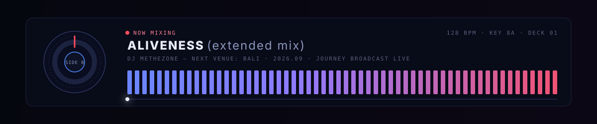

<div align="center">
  
</div>

<br/>

<p align="center">
  <em>Every system here answers one question —</em><br/>
  <strong>what makes you feel alive?</strong>
</p>

<div align="center">
  
</div>

## `ZONE://ORIGIN` — the signal

In 2023, mid-flight, the feeling of being alive went quiet — and it never fully came back on its own.
So I stopped waiting for it and started **engineering** it: coffee that locks you in, companions that remember everything, systems that keep entire companies awake.

Every build since is the same experiment wearing a different interface.

> 🔵 **blue** — the heart that went quiet.&nbsp;&nbsp;🔴 **red** — wanting everyone else's to stay loud.
> That gradient is the whole operating system.

## `ZONE://SYSTEM` — the orbit

<div align="center">
  
</div>

| Node | What it is | State |
| --- | --- | --- |
| **[ARCA](https://github.com/METHEZONE/arca)** | AX company companion — a character that lives in your company's Slack, desktop and phone, and becomes its brain | 🏆 `Hyundai ZER01NE Sprint '26 — winner` · deployed |
| **AGORA** | agent marketplace — buy and sell agent harnesses like software used to be sold | `building` |
| **ZONEBRAIN** | personal knowledge graph — Gmail, Calendar and Slack distilled into a bi-temporal Graphiti × Neo4j memory | `v0.3 · syncing` |
| **[PIX](https://github.com/METHEZONE/pix)** | AI companion that remembers everything and gamifies your life | `alive` |
| **THE ZONE BIO** | where the experiments become physical — [LOCK IN COFFEE](https://thezonebio.com) and the aliveness product line | `shipping` |

## `ZONE://AGENT.ARCA` — currently running

<div align="center">
  
</div>

ARCA is the thesis in one character: **AI should do the labor so humans can do the living.**
It moved from capstone sketch → Hyundai ZER01NE Sprint final winner → a real company brain running inside a real company. It keeps running.

## `ZONE://FREQUENCY` — side B

<div align="center">
  
</div>

The same hands that write agents are learning to mix.
**September 2026 the journey moves to Bali** — becoming a DJ and broadcasting the whole arc in public. The systems above run themselves; that's the point. They fund the frequency.

## `ZONE://LOADOUT`

```txt
LANGS     Swift · TypeScript · Python · Solidity
SYSTEMS   agents · MCP · Graphiti · Neo4j · Vercel · Supabase · onchain
PRACTICE  build the whole stack, automate yourself out, keep only the aliveness
```

## `ZONE://TELEMETRY`

<div align="center">
  
</div>

<picture>
  <source media="(prefers-color-scheme: dark)" srcset="https://raw.githubusercontent.com/METHEZONE/METHEZONE/output/github-snake-dark.svg" />
  <source media="(prefers-color-scheme: light)" srcset="https://raw.githubusercontent.com/METHEZONE/METHEZONE/output/github-snake.svg" />
  
</picture>

## `ZONE://LINK` — open channel

<p align="center">
  <a href="https://x.com/minthezone"><code>x → @minthezone</code></a>&nbsp;&nbsp;·&nbsp;&nbsp;
  <a href="https://instagram.com/i.minthezone"><code>ig → @i.minthezone</code></a>&nbsp;&nbsp;·&nbsp;&nbsp;
  <a href="https://thezonebio.com"><code>web → thezonebio.com</code></a>&nbsp;&nbsp;·&nbsp;&nbsp;
  <a href="mailto:me@thezonebio.com"><code>mail → me@thezonebio.com</code></a>
</p>

<div align="center">
  
</div>

<p align="center">
  <code>NEXT STAGE — automate the labor, broadcast the journey, stay loud.</code>
</p>
