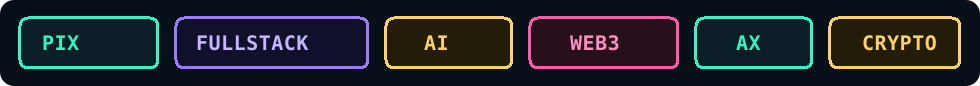
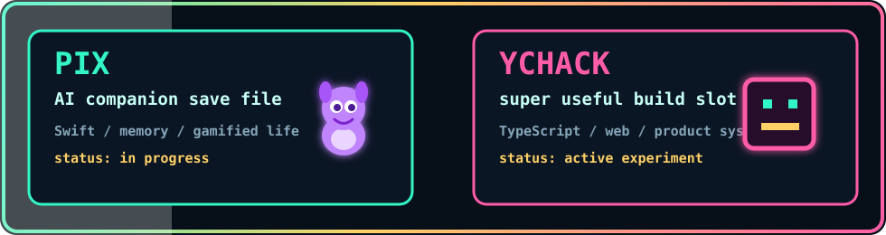
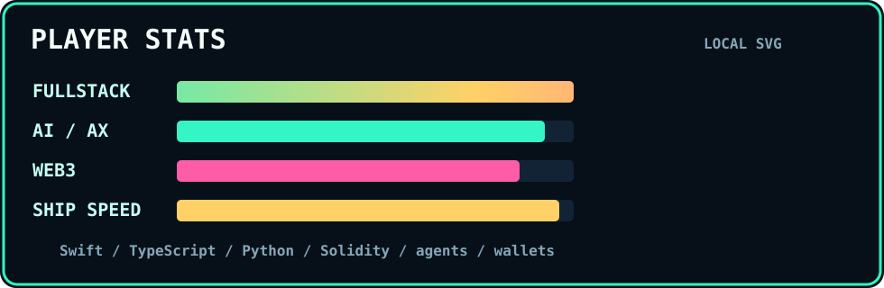
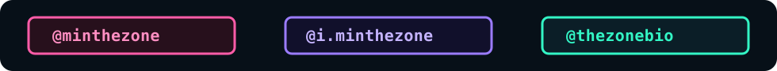

<h1 align="center">METHEZONE ARCADE</h1>
<p align="center"><strong>AX, fullstack, web, AI, crypto, web3, and every weird edge of software</strong></p>

<div align="center">
  
</div>

<div align="center">
  
</div>

```txt
PLAYER: METHEZONE
CLASS : fullstack AX / AI / web3 builder
RANGE : web apps, agents, automation, crypto, infra, product systems
MODE  : build across the whole stack until the idea becomes real
```

<div align="center">
  
</div>

## CURRENT QUEST LOG

| Quest | Status | Loot |
| --- | --- | --- |
| Build Pix into a friendly memory companion | `in progress` | Swift, agents, personal OS |
| Ship fullstack products end to end | `active` | web, infra, payments, databases |
| Turn business mess into AX systems | `active` | automation, dashboards, operations |
| Explore AI, crypto, and web3 edges | `always on` | agents, onchain systems, experiments |

## PARTY MEMBERS

| Character | Role | Special Move |
| --- | --- | --- |
| `Pix` | AI companion | remembers the useful bits and turns them into quests |
| `OpenClaw agents` | server-side crew | run background missions while the player sleeps |
| `AX systems` | business automation layer | connects tools, data, workflows, and decisions |
| `web3 builds` | onchain experiment zone | turns tokens, wallets, and protocols into products |
| `THE ZONE BIO` | real-world product line | brings experiments into customers' hands |
| `METHEZONE` | player one | builds across the whole dev map |

## TECH INVENTORY

```txt
RANGE      AX / fullstack / web / AI / crypto / web3
LANGS      Swift / TypeScript / JavaScript / Python / Solidity
SYSTEMS    agents / MCP / APIs / wallets / Vercel / Supabase / automations
BUILDS     apps / dashboards / checkout flows / AI companions / onchain tools
TASTE      playful interfaces, useful weirdness, game-feel software
```

## FEATURED SAVE FILES

<div align="center">
  
</div>

## PLAYER STATS

<div align="center">
  
</div>

## CONTRIBUTION DUNGEON

<picture>
  <source media="(prefers-color-scheme: dark)" srcset="https://raw.githubusercontent.com/METHEZONE/METHEZONE/output/github-snake-dark.svg" />
  <source media="(prefers-color-scheme: light)" srcset="https://raw.githubusercontent.com/METHEZONE/METHEZONE/output/github-snake.svg" />
  
</picture>

## CONTACT PORTALS

<div align="center">
  
</div>

```txt
NEXT STAGE: build every layer, make it feel alive, and ship the strange useful thing.
```
